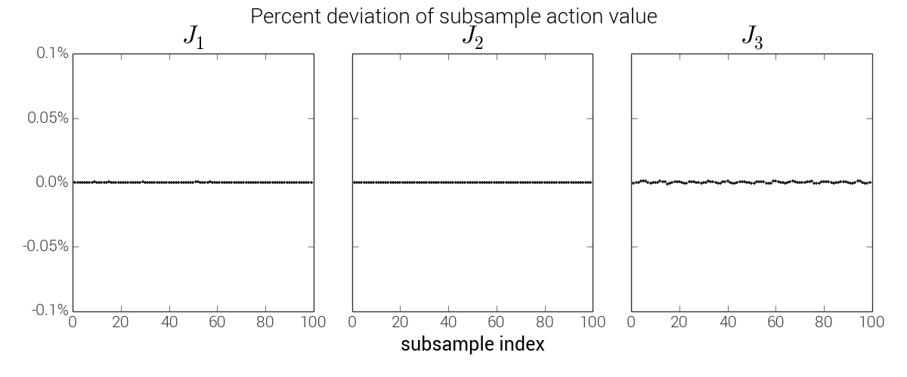
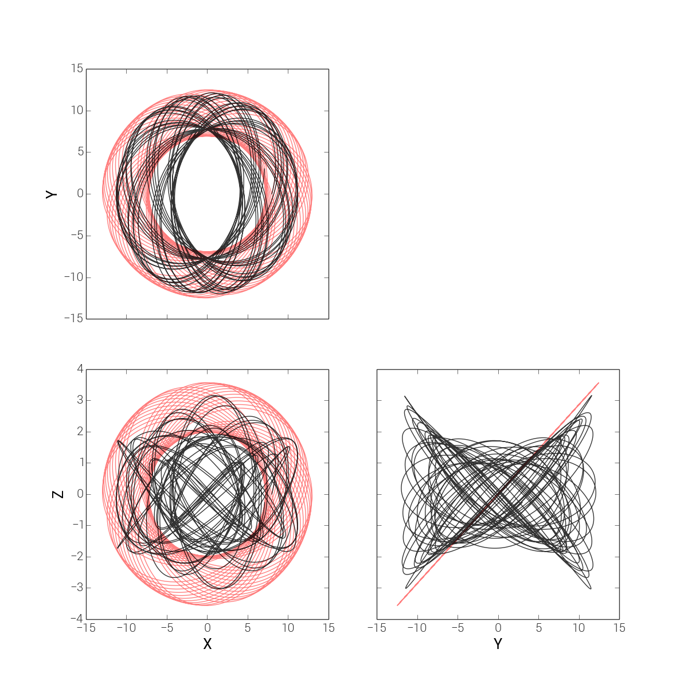
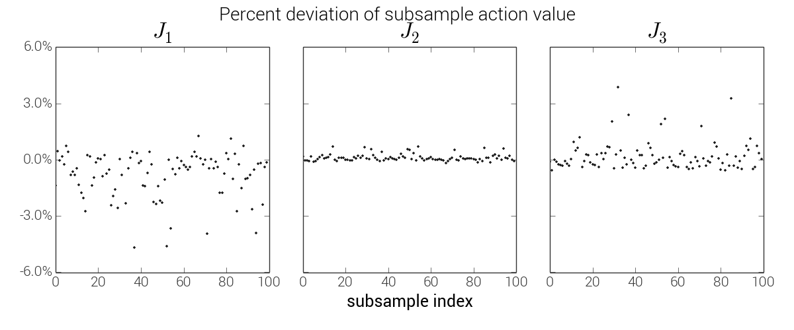
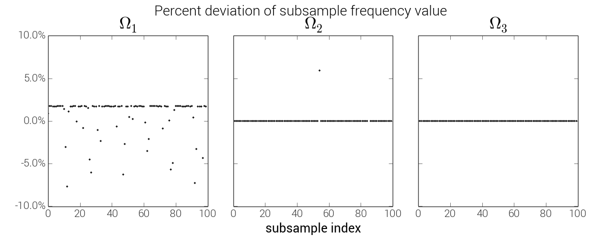
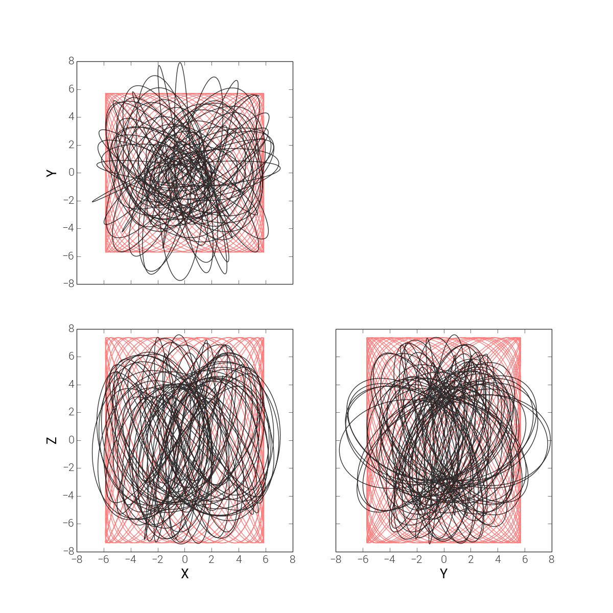
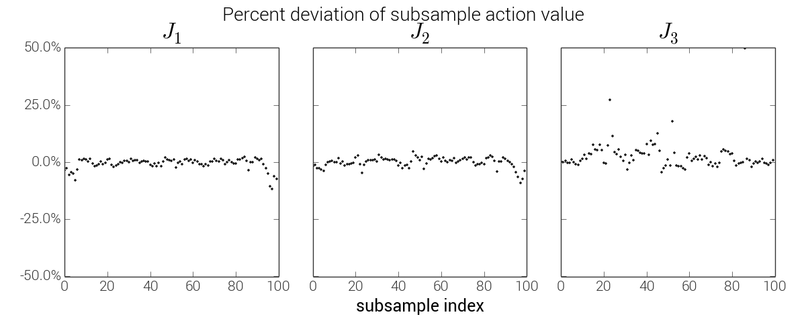
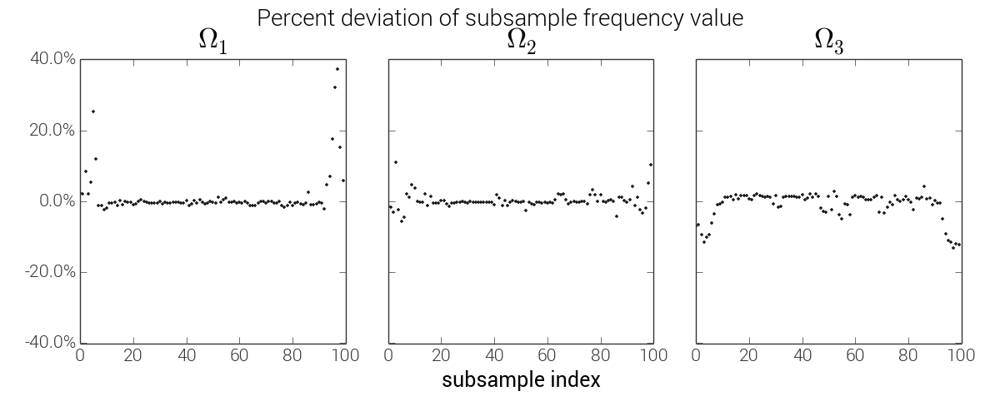

.. _actionangle:

*************************************************
Actions, angles, and frequencies for three orbits
*************************************************

Introduction
============

Regular orbits permit a (local) transformation to a set of canonical coordinates
such that the momenta are independent, isolating integrals of motion (the actions,
:math:`\boldsymbol{J}`) and the conjugate coordinate variables (the angles,
:math:`\boldsymbol{\theta}`) linearly increase time. Action-angle coordinates are
useful for a number of applications because Hamilton's equations -- the equations
of motion -- are so simple:

.. math::

    H &= H(\boldsymbol{J})\\
    \dot{\boldsymbol{J}} &= -\frac{\partial H}{\partial \boldsymbol{\theta}} = 0\\
    \dot{\boldsymbol{\theta}} &= \frac{\partial H}{\partial \boldsymbol{J}} = \boldsymbol{\Omega}(\boldsymbol{J}) = {\rm constant}

Analytic transformations from phase-space to action-angle coordinates are only
known for a few simple cases where the gravitational potential is separable or
has many symmetries. However, astronomical systems can often be triaxial or
have complex radial profiles that are not captured by these simple systems.
Here we have implemented the method described in
:ref:`Sanders & Binney (2014) <references>` for computing actions and angles
for an arbitrary numerically integrated orbit. We test it below on three orbits:

* :ref:`a loop orbit in an axisymmetric potential <axisymmetric>`,
* :ref:`a loop orbit in a triaxial potential <triaxialloop>`,
* :ref:`an irregular orbit in the same triaxial potential <triaxialchaotic>`.

We do not describe the method in detail, but only show

The code that produces the figures below can be found on GitHub
`at this link <https://github.com/stream-team/stream-team/blob/master/docs/_code/dynamics.py>`_.

.. _axisymmetric:

Axisymmetric potential
----------------------

For an example of an axisymmetric potential, we use a flattened logarithmic
potential:

.. math::

    \Phi(x,y,z) = \frac{1}{2}v_{\rm c}^2\ln (x^2 + y^2 + (z/q)^2)

with :math:`v_{\rm c}=0.15` and :math:`q=0.85` and integrate an orbit from
initial conditions:

.. math::

    \boldsymbol{r} &= (8, 0, 0)\\
    \boldsymbol{v} &= (0.075, 0.15, 0.05)

.. note::

    Units are unimportant for this scale-free potential, but the numbers were
    chosen with the unit system (kpc, Myr, :math:`{\rm M}_\odot`) in mind.

The orbit is shown in the meridional plane in the figure below (black). In red,
we show the orbit from the same initial conditions in the best-fitting Isochrone
potential (the toy potential for loop orbits)

.. image:: ../_static/dynamics/orbit_Rz_axisymmetricloop.png

For the "true" orbit in the potential of interest, we first compute the actions,
angles, and frequencies using the full orbit (200000 timesteps). We then break
the orbit into 100 evenly spaced sub-sections and compute the actions and
frequencies for each sub-section of the orbit. Below we plot the percent deviation
of the actions computed for each sub-section with relation to the actions computed
for the total orbit, and the same for the frequencies. For this orbit, the
deviations are all :math:`\ll` 1%.

.. image:: ../_static/dynamics/freq_hist_axisymmetricloop.png

Triaxial potential
------------------

.. _triaxialloop:

Loop orbit
^^^^^^^^^^

.. _triaxialchaotic:

Irregular orbit
^^^^^^^^^^^^^^^

.. _references:

References
==========

* Binney & Tremaine (2008) `Galactic Dynamics <http://press.princeton.edu/titles/8697.html>`_
* Sanders & Binney (2014) `Actions, angles and frequencies for numerically integrated orbits <http://arxiv.org/abs/1401.3600>`_
* McGill & Binney (1990) `Torus construction in general gravitational potentials <http://articles.adsabs.harvard.edu/cgi-bin/nph-iarticle_query?1990MNRAS.244..634M&amp;data_type=PDF_HIGH&amp;whole_paper=YES&amp;type=PRINTER&amp;filetype=.pdf>`_