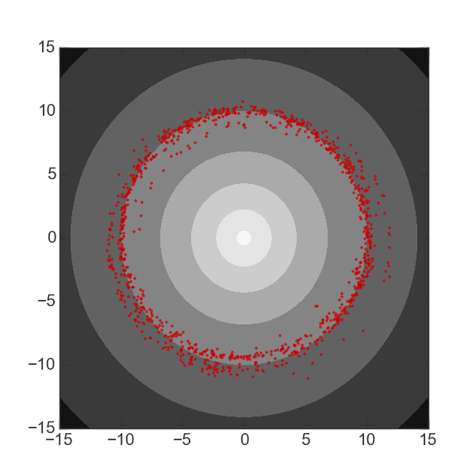

.. _integrate_potential_example:

Integrating and plotting an orbit in an NFW potential
=====================================================

We first need to import some relevant packages::

   import numpy as np
   from streamteam.coordinates import spherical_to_cartesian
   import streamteam.integrate as si
   import streamteam.potential as sp
   from streamteam.units import galactic

The variable ``galactic`` is defined and included in this package as as
short-hand for what I refer to as a Galactic unit system: :math:`{\rm kpc}`,
:math:`{\rm Myr}`, :math:`{\rm M}_\odot`. It is simply a tuple of
:class:`astropy.units.Unit` objects that define this unit system.

We will now create a potential object to work with. For this example, we'll
use a spherical NFW potential, parametrized by a scale radius and the
circular velocity at the scale radius::

   v_c = (200*u.km/u.s).decompose(galactic).value
   potential = sp.SphericalNFWPotential(v_c=v_c, r_s=10., units=units)

The easiest way to integrate an orbit in this potential is to use the
:meth:`~streamteam.potential.Potential.integrate_orbit` method, which accepts
a single set of (or array of) initial conditions and a specification for the
time-stepping and performs the integration for you::

   initial_conditions = np.array([10., 0, 0, 0, v_c, 0])
   t,orbit = potential.integrate_orbit(initial_conditions, dt=0.5, nsteps=10000)

This method returns an array of times, ``t``, and the orbit, ``orbit``.
By default, this method uses Leapfrog integration to compute the orbit
(:class:`~streamteam.integrate.LeapfrogIntegrator`), but you can optionally specify
a different integrator class as a keyword argument::

   t,orbit = potential.integrate_orbit(initial_conditions, dt=0.5, nsteps=10000,
                                       Integrator=si.DOPRI853Integrator)

We can integrate many orbits in parallel by passing in a 2D array of initial
conditions. Here, as an example, we'll generate some random initial
conditions by sampling from a Gaussian around our initial orbit::

   norbits = 1000
   stddev = [0.1,0.1,0.1,0.01,0.01,0.01] # 100 pc spatial scale, ~10 km/s velocity scale
   initial_conditions = np.random.normal(initial_conditions, stddev, size=(norbits,6))
   t,orbits = potential.integrate_orbit(initial_conditions, dt=0.5, nsteps=10000)

We'll now plot the final positions of these orbits over isopotential contours.
We start by using the :meth:`~streamteam.potential.Potential.plot_contours`
method of the ``potential`` object to plot the potential contours. This function
returns a :class:`~matplotlib.figure.Figure` object, which we can then use to
over-plot the orbit points::

   x = y = np.linspace(-15,15,100)
   fig = potential.plot_contours(grid=(x,y,0), cmap=cm.Greys)
   fig.axes[0].plot(orbits[-1,:,0], orbits[-1,:,1], marker='.',
                    linestyle='none', alpha=0.75, color='#cc0000')

