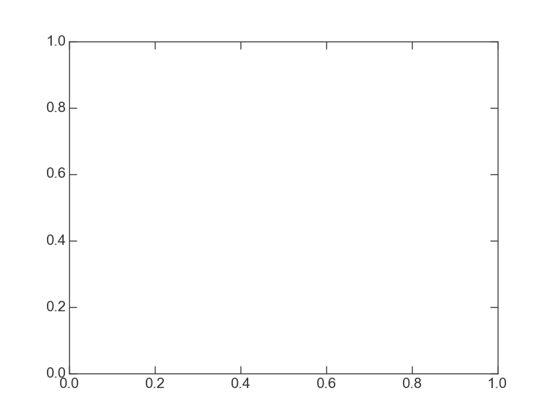

.. _compositepotential:

************************************
Creating a multi-component potential
************************************

Introduction
============

Potential objects can be combined into more complex *composite* potentials
using the :class:`~streamteam.potential.CompositePotential` class. This
class operates like a Python dictionary in that each component potential
must be named, and the potentials can either be passed in to the initializer
or added after the composite potential container is already created. Either
way, each component potential must be instantiated before adding it to the
composite potential::

    >>> from streamteam.units import galactic
    >>> disk = sp.MiyamotoNagaiPotential(m=1E11, a=6.5, b=0.27, units=galactic)
    >>> bulge = sp.HernquistPotential(m=3E10, c=0.7, units=galactic)
    >>> pot = sp.CompositePotential(disk=disk, bulge=bulge)

is equivalent to::

    >>> pot = sp.CompositePotential()
    >>> pot['disk'] = disk
    >>> pot['bulge'] = bulge

The resulting potential object has all of the same properties as individual
potential objects::

    >>> pot.value([1.,-1.,0.])
    array([-0.12891172])
    >>> pot.acceleration([1.,-1.,0.])
    array([[-0.02271507,  0.02271507, -0.        ]])
    >>> x = z = np.linspace(-3.,3.,100)
    >>> pot.plot_contours(grid=(x,0,z))

