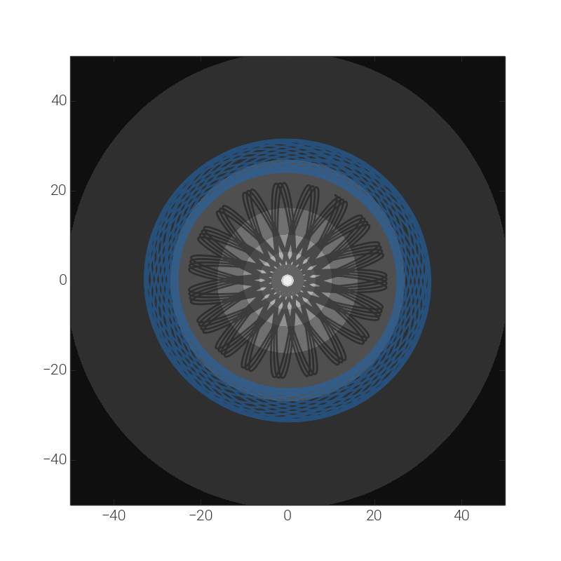

.. _potential:

*************************************************
Gravitational potentials (`streamteam.potential`)
*************************************************

Introduction
============

This subpackage provides a number of classes for working with parametric
gravitational potentials. There are `base classes`_ for defining custom
potentials (see :ref:`custompotential` for more information), but more
useful are the `built-in potentials`_. These are commonly used potentials
that have the potential form, gradient (and acceleration), and (in some cases)
Hessians available as methods. These are particularly useful in combination
with the `streamteam.integrate` subpackage -- see the `example`_ below for a
use case.

Getting started with the built-in classes
=========================================

The built-in potentials are all initialized by passing in parameter values. To
see what parameters are available for a given potential, check the
documentation for the individual classes below. You must also specify a unit
system when initializing a potential. A unit system is a set of non-reducible
units and must at least contain Astropy Unit objects for length, mass, and
time, and optionally an angle unit. For example,
`units = (u.kpc, u.Msun, u.Myr, u.radian)`.

All of the built-in potential objects have defined methods that evaluate
the value of the potential or the gradient/acceleration at a given
position(s). For example, here we will create a potential object for a
2D point mass located at the origin with unit mass::

    >>> ptmass = PointMassPotential(m=1., x0=[0.,0.], units=(u.Msun, u.au, u.yr))
    >>> ptmass
    <PointMassPotential: x0=[0.0, 0.0], m=1.00>

We can then evaluate the value of the potential at some other position::

    >>> ptmass.value([1.,-1.])
    -27.922166224010091

Or at multiple positions, by passing in a 2D array::

    >>> ptmass.value([[1.,-1.],[2.,3.]])
    array([-27.92216622, -10.95197465])

We may also compute the gradient of the potential or acceleration due to the potential::

    >>> ptmass.gradient([1.,-1.])
    array([ 13.96108311, -13.96108311])
    >>> ptmass.acceleration([1.,-1.])
    array([ -13.96108311, 13.96108311])

The position(s) must be specified in the same length units as specified in
the unit system.

These objects also provide ... TODO ... plotting isopotential contours, either as 1D slices
or contour plots over 2D grids. To plot a 1D slice over the dimension of
interest, you pass in a grid of values to compute the potential on and
then just numerical values for the other dimensions. For example, to
make a 1D plot of the potential contour at :math:`y=0,z=1`::

    >>> p = sp.MiyamotoNagaiPotential(m=1E11, a=6.5, b=0.27, units=(u.kpc, u.Msun, u.Myr))
    >>> fig,axes = p.plot_contours(grid=(np.linspace(-15,15,100), 0., 1.))

Produces a plot like:

.. image:: ../_static/potential/miyamoto-nagai-1d.png

To instead make a 2D contour plot along, for example, :math:`y=0`, pass in
a grid of values for :math:`x` and a grid of values for :math:`z` (the
meshgridding is taken care of internally)::

   >>> x = np.linspace(-15,15,100)
   >>> z = np.linspace(-5,5,100)
   >>> p.plot_contours(grid=(x, 1., z))

Produces a plot like:

.. image:: ../_static/potential/miyamoto-nagai-2d.png

.. _example:

Example: Integrating and plotting an orbit in an NFW potential
==============================================================

First we will define the potential object. We'll just use a spherical NFW
halo by setting the axis ratios to unity::

   import astropy.units as u
   import numpy as np
   import streamteam.potential as sp

   units = (u.kpc, u.Msun, u.Myr)
   v_h = (250*u.km/u.s).decompose(units).value
   potential = sp.SphericalNFWPotential(v_h=v_h, r_h=10., units=units)

Now we need to define an integrator object to compute an orbit. We'll use the
Leapfrog integration scheme implemented in the `integrate` subpackage. The
integrator assumes that the acceleration function accepts time and position,
but the potential acceleration method only accepts a position, so we define
a temporary (lambda) function to get around this::

   import streamteam.integrate as si
   acc = lambda t,x: potential.acceleration(x)
   integrator = si.LeapfrogIntegrator(acc)

We'll now compute orbits for two different initial conditions::

   x0 = np.array([[11.,6.,19.],[31.,0.,-4.]])
   v0 = ([[50.,0.,0.],[120.,-120.,375.]]*u.km/u.s).decompose(units).value
   w0 = np.hstack((x0,v0))
   t,ws = integrator.run(w0, dt=1., nsteps=10000)

And finally, over plot the orbits on the potential contours::

   import matplotlib.pyplot as plt
   from matplotlib import cm
   x = np.linspace(-50,50,200)
   z = np.linspace(-50,50,200)
   fig,ax = potential.plot_contours(grid=(x,0.,z), cmap=cm.gray_r)
   ax.plot(ws[:,0,0], ws[:,0,2], marker=None, lw=2., alpha=0.6)
   ax.plot(ws[:,1,0], ws[:,1,2], marker=None, lw=2., alpha=0.6)
   fig.set_size_inches(8,8)

Reference/API
=============

.. _base:

Base classes
------------

.. autosummary::
   :nosignatures:
   :toctree: _potential/
   :template: class.rst

   streamteam.potential.Potential
   streamteam.potential.CartesianPotential
   streamteam.potential.CompositePotential

-------------------------------------------------------------

.. _builtin:

Built-in potentials
-------------------

.. autosummary::
   :nosignatures:
   :toctree: _potential/
   :template: class.rst

   streamteam.potential.HarmonicOscillatorPotential
   streamteam.potential.HernquistPotential
   streamteam.potential.IsochronePotential
   streamteam.potential.JaffePotential
   streamteam.potential.LeeSutoTriaxialNFWPotential
   streamteam.potential.LogarithmicPotential
   streamteam.potential.MiyamotoNagaiPotential
   streamteam.potential.PointMassPotential
   streamteam.potential.SphericalNFWPotential

