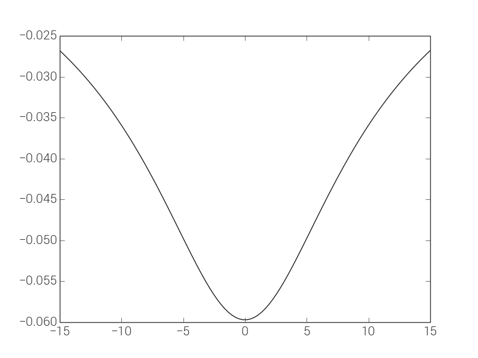
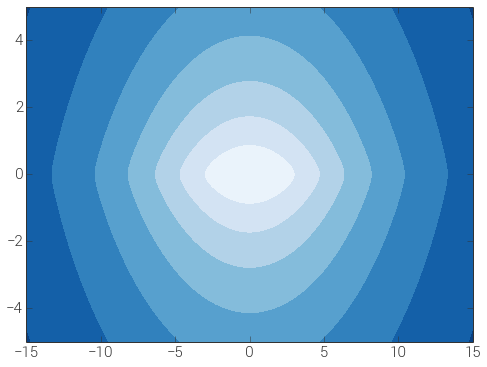

.. _potential:

*************************************************
Gravitational potentials (`gary.potential`)
*************************************************

Introduction
============

This subpackage provides a number of classes for working with parametric
gravitational potentials. There are `base classes`_ for defining custom
potentials (see :ref:`custompotential` for more information), but more
useful are the `built-in potentials`_. These are commonly used potentials
that have methods for computing the potential value, gradient, and (in some
cases) Hessian. These are particularly useful in combination with
the :ref:`integrate <integrate>` subpackage (see
:doc:`this example <../examples/integrate_potential_example>`).

Getting started with the built-in classes
=========================================

The built-in potentials are all initialized by passing in keyword argument
parameter values. To see what parameters are available for a given potential,
check the documentation for the individual classes below. You must also specify
a unit system when initializing a potential. A unit system is a set of
non-reducible units and must at least contain :class:`astropy.units.Unit` objects
for length, mass, and time, and optionally an angle unit. For example,
``units = (u.kpc, u.Msun, u.Myr, u.radian)``.

All of the built-in potential objects have defined methods that evaluate
the value of the potential and the gradient/acceleration at a given
position(s). For example, here we will create a potential object for a
2D point mass located at the origin with unit mass::

    >>> ptmass = PointMassPotential(m=1., x0=[0.,0.], units=(u.Msun, u.au, u.yr))
    >>> ptmass
    <PointMassPotential: x0=[0.0, 0.0], m=1.00>

We can then evaluate the value of the potential at some other position::

    >>> ptmass.value([1.,-1.])
    -27.922166224010091

Or at multiple positions, by passing in a 2D array::

    >>> ptmass.value([[1.,-1.],[2.,3.],[12.,-2.]])
    array([-27.92216622, -10.95197465])

We may also compute the gradient of the potential or acceleration due to the potential::

    >>> ptmass.gradient([1.,-1.])
    array([ 13.96108311, -13.96108311])
    >>> ptmass.acceleration([1.,-1.])
    array([ -13.96108311, 13.96108311])

The position(s) must be specified in the same length units as specified in
the unit system.

.. These objects also provide more specialized methods such as
.. :meth:`~gary.potential.Potential.plot_contours`, for plotting isopotential
.. contours in both 1D and 2D, and :meth:`~gary.potential.Potential.mass_enclosed`,
.. which estimates the mass enclosed within a specified spherical radius.

:meth:`~gary.potential.Potential.plot_contours` supports plotting
either 1D slices or 2D contour plots of isopotentials. To plot a 1D slice
over the dimension of interest, pass in a grid of values for that dimension
and numerical values for the others. For example, to make a 1D plot of the
potential value as a function of :math:`x` position at :math:`y=0, z=1`::

    >>> p = sp.MiyamotoNagaiPotential(m=1E11, a=6.5, b=0.27, units=(u.kpc, u.Msun, u.Myr))
    >>> fig,axes = p.plot_contours(grid=(np.linspace(-15,15,100), 0., 1.))

Produces a plot like:

To instead make a 2D contour plot over :math:`x` and :math:`z` along with
:math:`y=0`, pass in a 1D grid of values for :math:`x` and a 1D grid of values
for :math:`z` (the meshgridding is taken care of internally)::

   >>> x = np.linspace(-15,15,100)
   >>> z = np.linspace(-5,5,100)
   >>> p.plot_contours(grid=(x, 1., z))

which produces:

:meth:`~gary.potential.Potential.mass_enclosed` is a method that
numerically estimates the mass enclosed within a spherical shell defined
by the specified position. This numerically estimates
:math:`\frac{d \Phi}{d r}` along the vector pointing at the specified position
and estimates the enclosed mass simply as
:math:`M(<r)\approx\frac{r^2}{G} \frac{d \Phi}{d r}`. This function can
be used to compute, for example, a mass profile::

  >>> pot = sp.SphericalNFWPotential(v_h=0.5, r_h=20., units=(u.kpc, u.Msun, u.Myr))
  >>> r = np.zeros((100,3))
  >>> r[:,0] = np.logspace(np.log10(20./100.), np.log10(20*100.), len(r))
  >>> m_profile = p.mass_enclosed(r)
  >>> plt.loglog(r/r_h, menc, marker=None)

.. image:: ../_static/potential/mass-profile.png

Further information
===================
More detailed information on using the package is provided on separate pages,
listed below.

.. toctree::
   :maxdepth: 1

   compositepotential
   custompotential

Reference/API
=============

.. _base:

Base classes
------------

.. autosummary::
   :nosignatures:
   :toctree: _potential/
   :template: class.rst

   gary.potential.Potential
   gary.potential.CartesianPotential
   gary.potential.CompositePotential

-------------------------------------------------------------

.. _builtin:

Built-in potentials
-------------------

.. autosummary::
   :toctree: _potential/
   :template: class.rst

   gary.potential.HarmonicOscillatorPotential
   gary.potential.HernquistPotential
   gary.potential.IsochronePotential
   gary.potential.JaffePotential
   gary.potential.KuzminPotential
   gary.potential.LeeSutoTriaxialNFWPotential
   gary.potential.LogarithmicPotential
   gary.potential.MiyamotoNagaiPotential
   gary.potential.PointMassPotential
   gary.potential.SphericalNFWPotential

